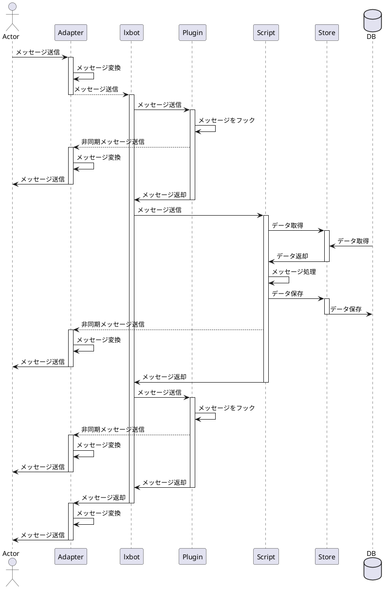

```plantuml
@startuml
actor Actor
database DB

participant Actor
participant Adapter
participant lxbot
participant Plugin
participant Script
participant Store
participant DB

Actor -> Adapter: メッセージ送信
activate Adapter
    Adapter -> Adapter: メッセージ変換
    Adapter --> lxbot: メッセージ送信
deactivate Adapter
activate lxbot
    lxbot -> Plugin: メッセージ送信
    activate Plugin
        Plugin -> Plugin: メッセージをフック
        Plugin --> Adapter: 非同期メッセージ送信
        activate Adapter
            Adapter -> Adapter: メッセージ変換
            Adapter -> Actor: メッセージ送信
        deactivate Adapter
        Plugin -> lxbot: メッセージ返却
    deactivate Plugin
    lxbot -> Script: メッセージ送信
    activate Script
        Script -> Store: データ取得
        activate Store
            Store <- DB: データ取得
            Store -> Script: データ返却
        deactivate Store
        Script -> Script: メッセージ処理
        Script -> Store: データ保存
        activate Store
            Store -> DB: データ保存
        deactivate Store
        Script --> Adapter: 非同期メッセージ送信
        activate Adapter
            Adapter -> Adapter: メッセージ変換
            Adapter -> Actor: メッセージ送信
        deactivate Adapter
        Script -> lxbot: メッセージ返却
    deactivate Script
    lxbot -> Plugin: メッセージ送信
    activate Plugin
        Plugin -> Plugin: メッセージをフック
        Plugin --> Adapter: 非同期メッセージ送信
        activate Adapter
            Adapter -> Adapter: メッセージ変換
            Adapter -> Actor: メッセージ送信
        deactivate Adapter
    Plugin -> lxbot: メッセージ返却
    deactivate Plugin
    lxbot -> Adapter: メッセージ返却
deactivate lxbot
activate Adapter
    Adapter -> Adapter: メッセージ変換
    Adapter -> Actor: メッセージ送信
deactivate Adapter
@enduml
```